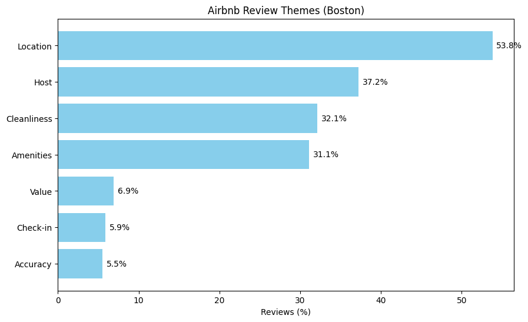
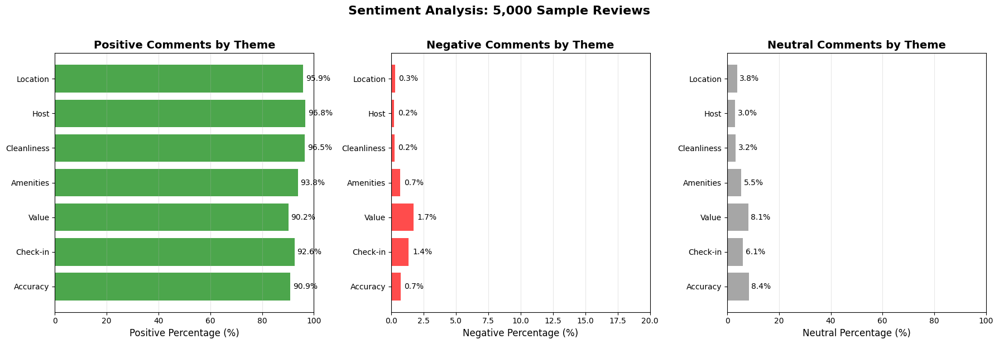
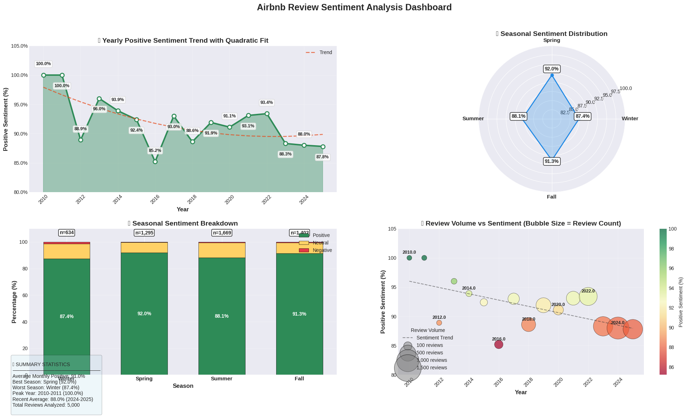

# Airbnb Reviews Sentiment Analysis (Boston)

## 📌 Project Description
This project analyzes a sample of **5,000 Airbnb reviews** in Boston to identify:

- The most discussed themes by guests (Location, Cleanliness, Host, Value, Check-in, Amenities, Accuracy)  
- The sentiment of the comments (positive, neutral, negative) for each theme  
- Sentiment trends over time: yearly, seasonal, and monthly

The project was developed in **Python** using **Pandas, Matplotlib, Seaborn, and TextBlob** for sentiment analysis and data visualization.

---

## 📊 Key Charts

### 1️⃣ Theme Frequency
This chart shows the percentage of reviews mentioning each theme.

---

### 2️⃣ Sentiment by Theme
Distribution of positive, neutral, and negative comments for each theme.

---

### 3️⃣ Temporal Analysis
Dashboard showing:  
- Yearly trend of positive sentiment  
- Sentiment distribution by season  
- Monthly sentiment and review volume (best and worst months)

---

## 🛠 Technologies Used
- **Python 3**  
- **Pandas** for data handling  
- **Matplotlib / Seaborn** for visualization  
- **TextBlob** for sentiment analysis  
- **Google Colab** for development and testing

---

## 🔗 Included Files
- `airbnb_reviews_analysis.ipynb` → full notebook with code and analysis  
- `images/` → folder containing saved charts  

---

## ⚡ Key Insights
- Most mentioned themes: Location, Cleanliness, Host  
- Theme with the most positive comments: Host  
- Theme with the most negative comments: Cleanliness  
- Best month for positive reviews: May  
- Worst month for positive reviews: July  
- Season with the highest positive sentiment: Spring
